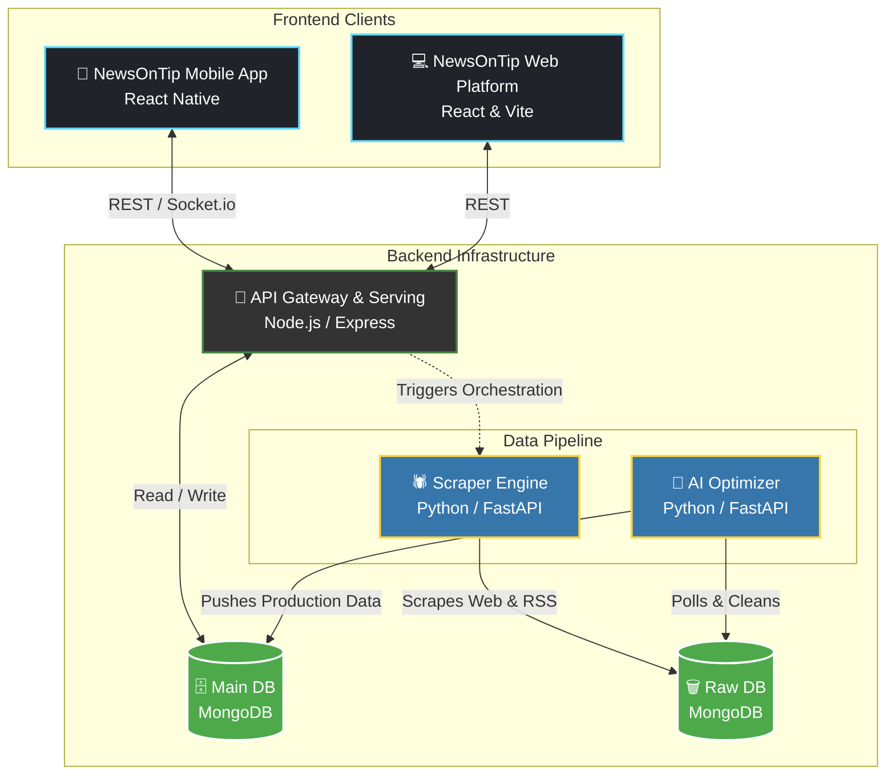
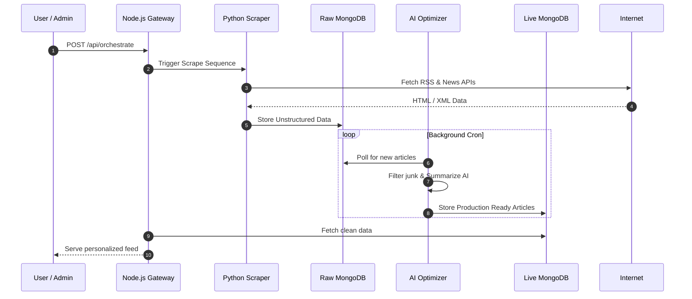

<div align="center">
  
  <h1>NewsOnTip 📰</h1>
  <p><em>An intelligent, full-stack news aggregator and personalized reading platform.</em></p>
  
  [](https://reactnative.dev/)
  [](https://nodejs.org/)
  [](https://python.org)
  [](https://mongodb.com/)
</div>

---

**NewsOnTip** scrapes thousands of articles daily, uses AI to optimize and summarize them, and serves them through a beautiful React Native mobile app and a sleek web platform.

## 🏗️ Project Architecture

This monorepo is divided into five distinct microservices/applications, representing a complete end-to-end data pipeline and user experience.



### Microservices Overview

1. **`inked/`** (Mobile App)
   - A cross-platform mobile application built with **React Native / Expo**. 
   - Features a dynamic onboarding carousel, personalized interest selection, real-time interactions via Socket.io, and a tailored news feed.

2. **`inked-website/`** (Web Frontend)
   - A fast, modern web application built with **React & Vite**.
   - Serves as the landing page and web-based reader for the platform.

3. **`main_backend/`** (API Gateway & Serving Layer)
   - A **Node.js / Express** server.
   - Handles all client-facing API requests (fetching trending news, user feeds, orchestrating scrapes).
   - Powers real-time live updates using Socket.io.
   - Connects to the `main` MongoDB database.

4. **`scraper_backend/`** (Data Collection Engine)
   - A **Python / FastAPI** service powering a distributed **Scrapy** web crawler.
   - Fetches live data from RSS feeds (prioritizing major Indian publishers like Times of India, The Hindu, NDTV) and various News APIs.
   - Dumps raw, unstructured data into the `scraper` MongoDB database.

5. **`optimizer_engine/`** (AI Processing Layer)
   - A **Python / FastAPI** service.
   - Polls the raw `scraper` database, processes and cleans the articles (removing HTML, generating summaries, ensuring image quality), and pushes the production-ready articles to the `main` database for the user-facing apps.

---

## 🚀 The Data Pipeline

The magic of NewsOnTip happens in the background. The flow works as follows:



---

## 🛠️ Tech Stack

<div align="center">
  <table>
    <tr>
      <td align="center"><strong>Frontend</strong></td>
      <td align="center"><strong>Backend APIs</strong></td>
      <td align="center"><strong>Data & Scraping</strong></td>
      <td align="center"><strong>DevOps & Infra</strong></td>
    </tr>
    <tr>
      <td>React Native<br/>React.js<br/>Vite<br/>TailwindCSS</td>
      <td>Node.js<br/>Express<br/>Socket.io<br/>Python FastAPI</td>
      <td>MongoDB Atlas<br/>Scrapy<br/>Feedparser<br/>BeautifulSoup</td>
      <td>npm / yarn<br/>pip<br/>Git</td>
    </tr>
  </table>
</div>

---

## ⚙️ Local Development Setup

To run this entire platform locally, you will need to start the three backend services and your frontend(s) of choice.

### 1. Prerequisites
- Node.js (v18+)
- Python (3.10+)
- MongoDB Atlas cluster (or local instance)

### 2. Environment Variables
You must create a `.env` file in **three** different folders: `main_backend`, `scraper_backend`, and `optimizer_engine`.
*(Refer to your internal documentation/credentials file for the exact API keys and MongoDB connection strings).*

### 3. Starting the Backends
You will need three separate terminal tabs:

**Terminal 1 (Main Backend):**
```bash
cd main_backend
npm install
npm run dev
# Runs on http://localhost:5000
```

**Terminal 2 (Scraper Backend):**
```bash
cd scraper_backend
pip install -r requirements.txt
python main.py
# Runs on http://localhost:8000
```

**Terminal 3 (Optimizer Engine):**
```bash
cd optimizer_engine
pip install -r requirements.txt
python main.py
# Runs on http://localhost:8001
```

### 4. Starting the Frontends

**Terminal 4 (React Native App):**
```bash
cd inked
npm install
npm start
# Follow the terminal instructions to open on iOS/Android emulator or physical device.
# (If using a physical Android device via USB, remember to run: adb reverse tcp:5000 tcp:5000)
```

**Terminal 5 (Web App - Optional):**
```bash
cd inked-website
npm install
npm run dev
# Runs on http://localhost:5173
```

---

## 📝 Triggering a Manual Scrape

Once all backends are running, you can manually trigger the AI pipeline to fetch the latest news by hitting your main backend:

```bash
curl -X POST http://localhost:5000/api/orchestrate
```

Watch the terminal logs as the scraper fetches the articles and the optimizer processes them into your live database!

<div align="center">
  <br/>
  <p>Made with ❤️ for modern news readers.</p>
</div>
